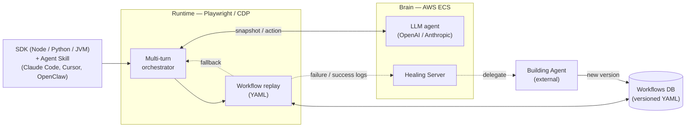
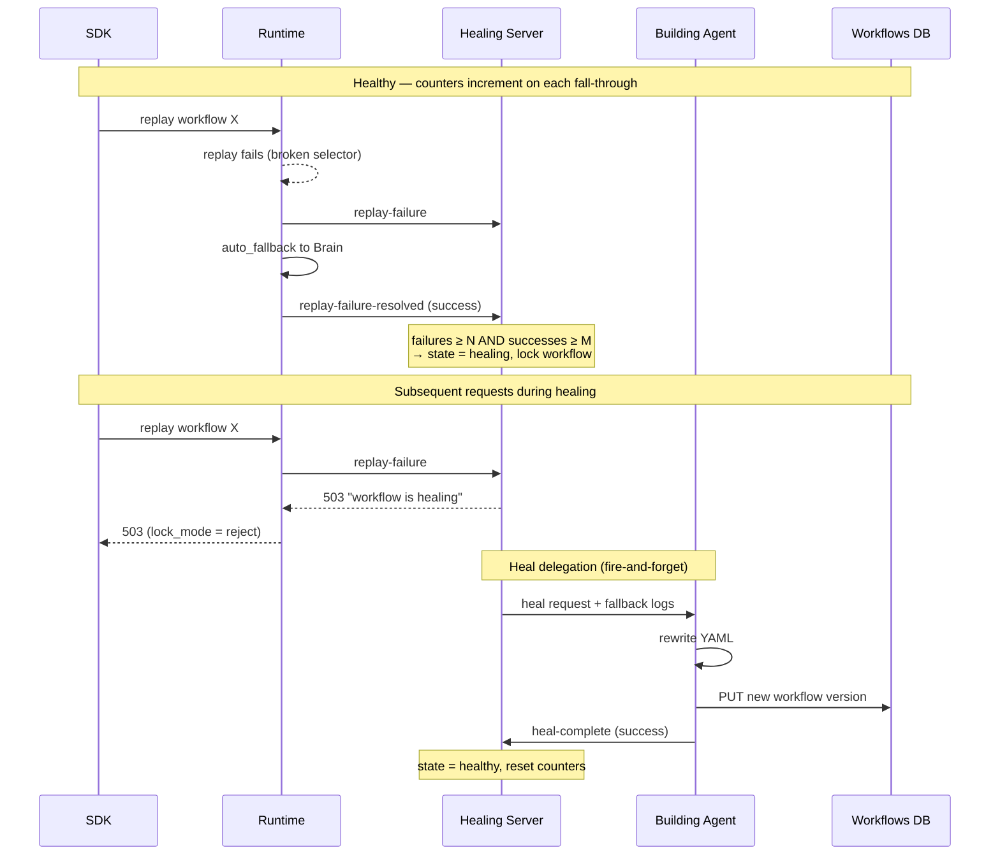

# ACT-2

A browser automation platform that combines AI-driven agents with deterministic, self-healing replay scripts. Enterprises automate browser-based workflows that are too narrow for dedicated integrations but too costly for humans — the platform makes the same task cheap and reliable when it runs millions of times.

## Problem

Pure LLM-driven browser agents work but don't scale economically when the same task runs at high volume — every run pays for inference, and runs are non-deterministic. Hand-coded scrapers are cheap and deterministic but break the moment the site changes, leading to either hours of manual fix-up or noisy fallbacks. The interesting space is the middle: a system where the AI agent can solve novel tasks, repeatable tasks compile down to deterministic playbacks, and the playbacks self-recover when the underlying site shifts.

## What I built

I architected ACT-2 end-to-end as a three-tier platform — **SDK → Runtime → Brain** — and own the design of the workflow + healing subsystem that lifts the platform above pure agentic execution.

### Three-tier architecture

- **SDK (Node.js, Python, JVM/Kotlin)** — developer-facing entry points. A single high-level call like `act("Login with username and password")` goes through the SDK to the Runtime.
- **Runtime** (Playwright/CDP, runs locally with the developer or on a fleet) — owns the browser lifecycle (acquire/release/attach/detach), session management, snapshot capture, DOM metadata extraction, multi-turn orchestration loop, and YAML replay execution. Each browser snapshot is reduced to structured DOM metadata with validated CSS selectors before reaching the Brain — this single optimization yields **~10x token reduction** on Brain API calls.
- **Brain (AWS ECS)** — server-side LLM orchestration with OpenAI and Anthropic backends, swappable based on task profile. Hosts the agent itself plus the supporting modules: Build (action-log → YAML), Retrieve (goal → YAML selection), Editor (UI for YAML management), and the Healing Server.

### Multi-turn orchestration

The Runtime turns a single high-level call into a complete automation flow: capture snapshot → call Brain for the next action → execute → loop until the goal succeeds or limits are hit. Configurable iteration / timeout / failure thresholds. So `act("Login with username and password")` becomes type-username → type-password → click-submit → verify automatically, end-to-end, without the SDK user wiring each step.

### Workflow system (YAML replay) — *design + architecture*

Most browser automation is repetitive — same login, same search, same form-fill. Paying an LLM every time is wasteful and non-deterministic. The Workflow system records successful agent runs as action logs, compiles them into human-readable YAML replay scripts, and executes them deterministically without Brain calls. ~10x cost and latency reduction on the repeated path. Failure of a YAML step gracefully falls back to the Brain agent, with full context of what succeeded so far.

I owned the design philosophy ("deterministic replay, graceful fallback"), the Replay/Build/Retrieve/Editor module split, and the YAML schema. Implementation was a team effort.

### Healing Server — *design (implementation by another engineer)*

Web environments shift unpredictably — selectors break, popups appear, A/B tests reroute flows. When a Workflow breaks, every failing request previously fell back to the Brain via `auto_fallback`. Under burst traffic on a single workflow, this single-day failure mode could erase the entire cost advantage of the Workflow system.

I designed the **Healing Server** as a thin coordination layer in the ACT-2 Server. The build engineer implemented it from my spec.

- **State machine** — `healthy → healing → degraded`, transitions gated on failure and Brain-fallback success counters (`failure ≥ N AND success ≥ M` to trigger heal; counters only increment in healthy state to avoid inflation during healing).
- **Lock modes** — when a workflow enters `healing`, incoming replay requests are either `reject`ed (default; batch jobs retry later) or `ignore`d (continue with auto-fallback; for low-priority workflows where Brain cost is acceptable during healing).
- **Delegation, not patching** — the Healing Server doesn't run LLMs or rewrite YAML. It collects the successful Brain-fallback logs, fire-and-forgets a heal request to an external Building Agent with that evidence, and waits for a callback. The Building Agent does the actual workflow rewrite via `PUT /v1/workflows/{id}` (creating a new version with `created_by: "self-recover"`).
- **Reuses existing infrastructure** — versioned `workflows` table, `JobManager` for fallback log queries, JWT internal auth, the existing `BuildService` LLM pipeline. Net new is just one table, one manager, and a small router.

The design discipline was important: the healing system stays small, observable, and testable because it doesn't try to be the AI patching system itself. It's a state machine plus a delegation contract. That separation is what made it implementable as a single spec.

### Agent Skill distribution (Claude Code, Cursor, OpenClaw)

ACT-2 ships as an installable Agent Skill, not just an SDK. The Python SDK includes a `skills/act2/` package — a Skill manifest plus reference docs covering the SDK and CLI surface, workflow patterns, composition patterns, decision frameworks, and anti-patterns — that AI agents discover and invoke natively. The CLI installs the skill into `.claude/`, `.cursor/`, and `.openclaw/` so any agent built on those harnesses can drive ACT-2 for browser tasks: `act2 act` for actions, `act2 ask` for extraction, `act2 snapshot` for page state, and `client.workflows` for the replay system.

This makes the platform composable from above as well as from below — a human developer can call ACT-2 directly via SDK, and a higher-level AI agent (an assistant building automations on a user's behalf) can invoke it as a tool. Internal use only, but widely adopted internally.

## Outcomes

- **In production**, currently used for internal workflow automation.
- **Reached as high as 2nd on the Mind2Web web-agent benchmark; currently 3rd.** (Resumes/CVs keep this abstract — full benchmark details belong on the website.)
- Multi-language SDK surface (Node, Python, Kotlin) gives customer teams flexibility on integration language.
- Distributed as an installable Agent Skill — adopted by AI agents (Claude Code, Cursor, OpenClaw) on the team in addition to direct SDK callers. Internal-only.
- ~10x token reduction on Brain API calls via DOM metadata extraction.
- ~10x cost / latency savings on the Workflow path versus pure agentic execution.
- Healing Server design makes the cost savings durable: workflows recover automatically from drift instead of degrading silently.

## Notes

- See `agentos-matching.md` for related work in the AgentOS stack (matching pipeline runs adjacent to ACT-2).
- Healing Server design doc is at `~/agent-pipeline/act-2/docs/yaml-replay/workflow-healing-design.md` (Owner: Gabe). v2 final, ~750 lines covering state machine, endpoints, race conditions, observability, prerequisites.
- Replay design philosophy is at `~/agent-pipeline/act-2/docs/yaml-replay/replay-design-philosophy.md` — useful talking points: deterministic replay + graceful fallback, watcher-as-interceptor pattern, failure-with-context handoff to Brain.
- Skill manifest at `~/agent-pipeline/act-2/app/sdks/python/skills/act2/SKILL.md` plus references (workflow-guide, decision-framework, anti-patterns, composition-patterns, sdk-reference, cli-reference).
- Benchmark is **Mind2Web**. Per Q44, full benchmark details belong on the website (e.g., dedicated ACT-2 page or grid cell), not on resumes/CVs — those keep "a public web-agent benchmark" phrasing for future-proofing against ranking changes.
