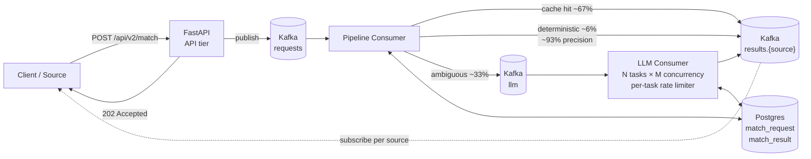

# AgentOS product matching pipeline

> Enhans is renaming this product line from CommerceOS to AgentOS. New copy uses AgentOS.

A SKU-to-product matching system for Korean e-commerce dynamic pricing. Given a target product and a list of candidate SKUs from external platforms (Coupang, Naver, Ohouse, etc.), the pipeline decides which SKUs are the same product. It runs at production scale with peak loads in the hundreds of thousands of decisions per day across multiple Korean enterprise clients.

## Problem

Dynamic pricing requires SKU-to-SKU matching across catalogs at production volume. The first version of this system, the prior CommerceOS (now AgentOS) implementation, ran every match through an LLM. That worked for accuracy but had three structural problems:

1. **Cost** — every decision paid full LLM inference cost, even for cases that were obviously the same or obviously different.
2. **Latency** — single-LLM-per-decision meant batch wall-time scaled linearly with traffic. Large batches took hours.
3. **No reinforcement** — past decisions weren't reused, so identical inputs paid full cost every time.

The triggering event was a customer promotion contract: ~15,000 target products per day for three weeks, with multiple SKU candidates per target. The original implementation couldn't absorb that economically. Something better had to ship before the promotion started.

## What I built

I architected and built the **first iteration (v1)** of the matching pipeline — the underlying funnel design, the async streaming pipeline shape, and the burst-handling architecture. Subsequent work on cost / latency / accuracy refinement was collaborative with the team, who took the v1 foundation through v2 (multi-client, multi-source) and into the production platform it is today.

### Three-stage funnel

The core insight was that most decisions don't need an LLM. The pipeline shapes traffic through three escalating layers:

1. **Reuse** — DB lookup against past mapping decisions. ~67% of production traffic short-circuits here at zero inference cost and ~immediate response.
2. **Hard rules** — deterministic rule-based engine that handles unambiguous matches and unambiguous non-matches via canonicalization, attribute checks, and the rulebook from `title-extractor.md`. ~6% of total traffic decided here, with ~93% precision.
3. **Selective LLM fallback** — only the genuinely ambiguous residual (~33%) is routed to an LLM judge, with structured evidence returned alongside the verdict.

The design moves the cost frontier: full-LLM was paying inference on 100% of decisions; the funnel pays it on roughly a third, while the cheap layers handle volume.

### Async streaming pipeline

The whole system is async by default. A `POST /api/v2/match` returns 202 Accepted with batch and per-SKU IDs immediately and publishes to a Kafka request topic; consumers pick up work and emit results to per-source Kafka topics that clients subscribe to independently.

Architecture follows hexagonal / clean conventions (domain / application / infrastructure / interfaces) so the pipeline's matching service is the same code path whether invoked from the FastAPI handler, a Kafka consumer, or the sync dev endpoint. Idempotency-keyed requests via `request_id` so retries are safe; per-source result topics so multiple downstream systems (price tracker, matching-source-finder, price-agent) consume independently without contention.

### Burst architecture

Traffic isn't uniform — it arrives in promotional spikes that can be 10×–20× steady-state. The first-iteration design had to keep the pipeline absorbing spikes without OOM, without 429s from upstream LLM APIs, and without dropping requests.

- **Sharded async LLM consumers** — N ECS tasks, each with M concurrent in-flight calls, so total concurrency = N × M. Capacity planned against the upstream LLM API limit so the system can saturate available throughput without blowing past it.
- **Per-task in-memory rate limiter** (sliding-window RPM + TPM) — each task pre-acquires capacity before calling the LLM and records actual token usage on response. The global RPM/TPM budget is divided by task count to give per-task budgets. This avoids a global lock-contention point while staying within upstream limits.
- **Kafka as elastic buffer** — burst traffic queues in Kafka rather than at the API layer, so the API tier stays responsive at 202 Accepted while consumers absorb at their sustainable rate. Kafka partition counts on request and LLM topics are tuned to match consumer concurrency.
- **Backpressure-friendly status flow** — every match request has a tracked state machine (queued → rule-evaluated → LLM-evaluated → result-emitted) with timing measurements at each step, so capacity planning is observable rather than guessed.

The first batch on the promotion the system was built for was ~44K SKUs across ~2,100 products in roughly 25 minutes of actual processing time (the rest was upstream gaps), and the system has scaled in throughput from there.

### v1 → v2 (collaborative)

v1 served a single client (the original promotion) with a hardcoded path and a single result topic. After the promotion proved out, the team generalized to v2: explicit `client` and `source` fields in the request body, per-source result topic naming so multiple consumers don't share a topic, and a sync dev endpoint for connector debugging. v1 stayed live for backward compatibility. The architecture move was straightforward because the v1 funnel and consumer topology were the right shape — just needed parameterization.

## Outcomes

- **+7.5pp accuracy** over the prior LLM-only baseline (71.9% → 79.4%, measured on an 11,893-pair labeled set).
- **~95% per-unit cost reduction** vs. the prior implementation, by paying LLM cost on ~33% of decisions instead of 100%.
- **>5× throughput improvement** vs. the prior implementation — sustains 120K+ SKUs/hour and 300K+ requests/day at peak.
- **Promotion-grade burst absorption** — initially built and contracted for a 3-week customer promotion at 15K daily product batches; has since stayed in production at higher daily volume.
- **Production confusion matrix** ≈ 98% true negative, 60% true positive — the precision/recall shape of a routing-first design that errs toward conservative LLM-fallback rather than over-claiming matches.

## Notes

- File renamed from `commerceos-matching.md` 2026-04-26 per Q52 (Enhans rename in progress).
- v1 architecture / first iteration / burst design — owned by Gabe. Cost/latency/accuracy refinement and v2 generalization — collaborative with the matching pipeline team.
- Stack-level details available in `~/agent-pipeline/ai-product-mapping-pipeline/README.md`, throughput spec at `docs/llm-throughput-capacity.md`, rate limiting at `docs/llm-rate-limiting.md`, March 2026 internal report transcript at `docs/ai-product-mapping-pipeline-report-2026-03-speaker-notes.md`.
- Customer names withheld (per Q28) — the system serves multiple Korean enterprise clients across electronics, FMCG, education, and home goods.
- Title-extractor and matching pipeline ship as related components of the same product (see `title-extractor.md`).
