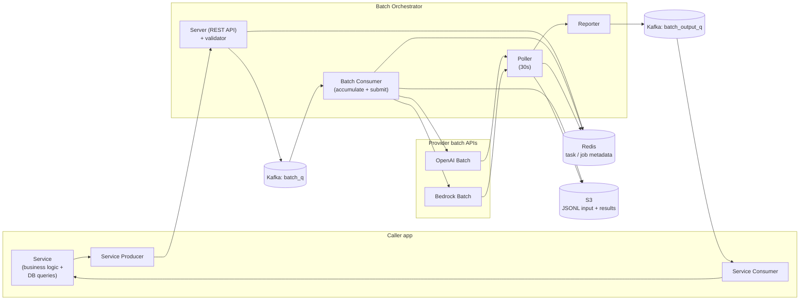
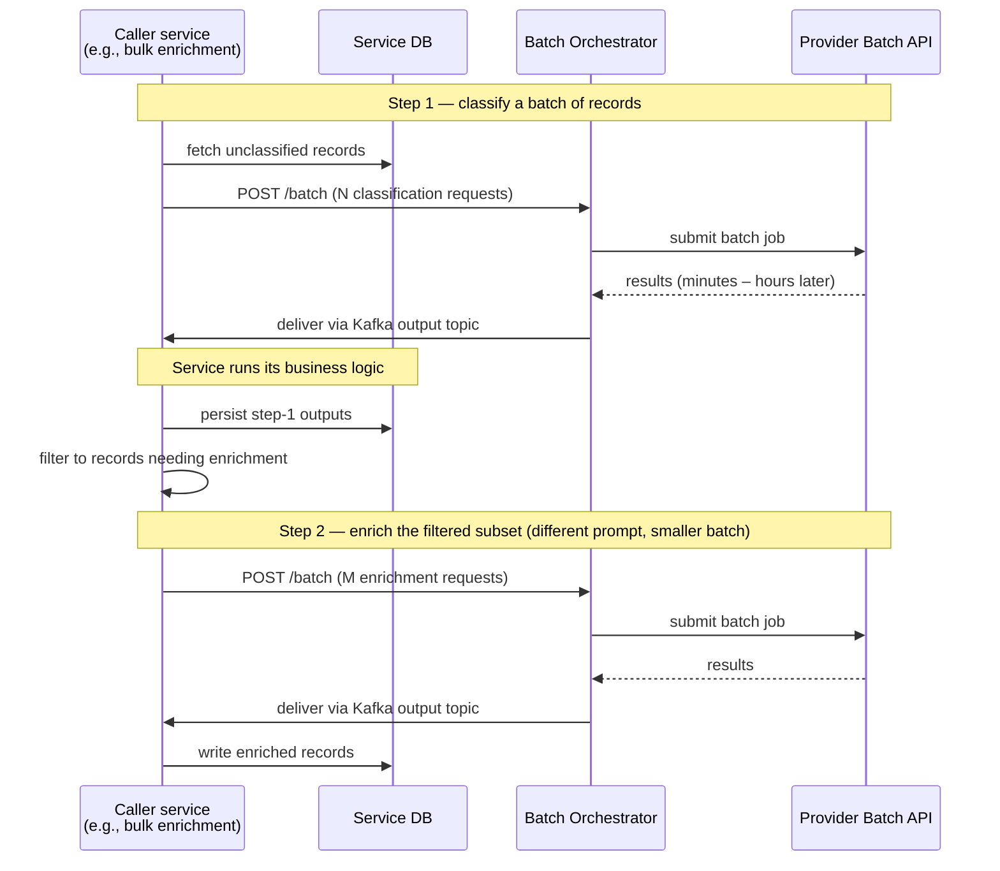

# LLM Batch Orchestrator

A production batch-LLM service that lets internal teams submit high-volume LLM workloads through provider-native **batch APIs** (OpenAI Batch, AWS Bedrock Batch Inference, etc.) instead of synchronous APIs — and crucially, **lets them compose multi-step tasks** where business logic and database lookups happen between inference steps.

## Problem

Across Enhans, multiple services run high-volume LLM workloads (matching, extraction, agent training data, evaluation pipelines). Synchronous APIs make the math punishing — at scale, per-call inference cost dominates the operating budget for any team that doesn't need real-time responses.

Provider batch APIs solve the cost problem (~50% cheaper than synchronous calls in the typical OpenAI / Bedrock case) — but only for **single-step tasks** out of the box. Most of our actual workloads aren't single-step. They look like:

> "For each row, classify it; for the classified-positive rows, fetch related rows from the DB; for those rows, generate a structured plan; persist the plan and notify."

That's three inference steps with database access and business logic between them. Provider batch APIs don't help directly because they're stateless single-shot interfaces. So either every team rebuilds the same async-batch plumbing, or they keep paying full sync-API cost for tasks that didn't need real-time.

I built the LLM Batch Orchestrator to make batch + multi-step workloads a first-class platform capability.

## What I built

A managed batch service exposing a thin REST API that any internal app can hit. Submitted requests are accumulated, submitted to the appropriate provider batch API, polled, and delivered back via Kafka — so the app's batch consumer can re-enter the orchestrator with derived requests for the next step.

### Three core components

- **Server (FastAPI)** — exposes a REST API, authenticates with `X-API-Key`, role-scoped (admin / user), validates per-provider payload constraints, mints `task:<task_name>-<date>-<uuid>` task IDs, persists task metadata to Redis, publishes to `batch_q`.
- **Batch Consumer** — accumulates queued tasks by `provider:model`, writes a JSONL input file to S3, submits the batch job to the provider API, persists the job metadata (`job:<provider>-<provider_job_id>`) to Redis. Accumulation is what makes the cost math work — provider batch APIs penalize tiny batches.
- **Poller + Reporter** — polls each in-flight provider job every 30s; on completion, downloads the results, archives them to S3, parses provider-specific result formats (OpenAI JSONL, Bedrock JSONL), updates Redis state, and publishes per-task results to the `batch_output_queue` Kafka topic. Caller apps subscribe and pick up exactly what they submitted, with their `task_id` preserved for correlation.

### Multi-step orchestration

The "multi-step" framing is what makes this an orchestrator and not just a batch proxy. A caller service's flow looks like this:

The orchestrator itself is stateless across steps — each batch is independent — but because results come back through Kafka, the caller service can naturally compose them: produce a derived batch from the previous step's outputs after running whatever DB queries or branching logic the workflow needs. This makes the cost-savings math work for workflows that aren't pure single-shot.

### Provider abstraction

OpenAI, Bedrock, and Azure are the three production providers; Gemini is planned. The validator and reporter are abstracted per-provider so adding a new provider is mostly a matter of writing the JSONL adapter and the result parser. The caller specifies `provider` and `model` per request — the orchestrator picks the right path.

## Outcomes

- **Production batch endpoint** consumed by multiple internal services for high-volume LLM workloads.
- **~50% cost reduction** per inference vs. synchronous API for callers who can tolerate batch latency (minutes to hours).
- **Multi-step batch workflows** are now a normal pattern internally — teams compose two- or three-step batches with DB lookups between them, instead of either rebuilding the async plumbing or paying full sync-API cost.
- **Provider-agnostic** — same API surface for OpenAI, Bedrock, and Azure; adding new providers is a contained change.
- Removes a class of work that every LLM-using team would otherwise have to redo (input JSONL packing, S3 staging, batch submission, polling, result parsing, error handling, retry logic).

## Notes

- Source at `~/agent-pipeline/ai-llm-batch-orchestrator/`. README and `GUIDE.md` are the developer-facing docs; `docs/architecture.md` and `docs/specs/` cover internals.
- Closely related to `agentos-matching.md` and other internal LLM-heavy services as their cost-optimization layer; the matching pipeline can use this orchestrator for non-real-time bulk work.
- Public production URL withheld from CV per Gabe's instruction.
