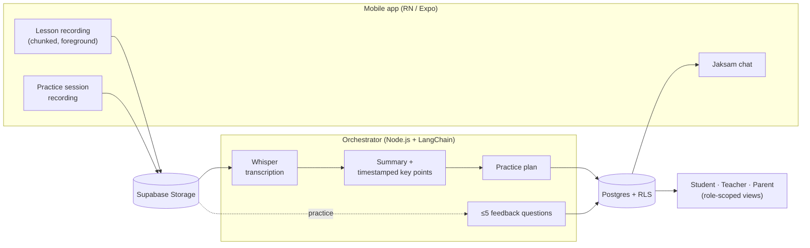
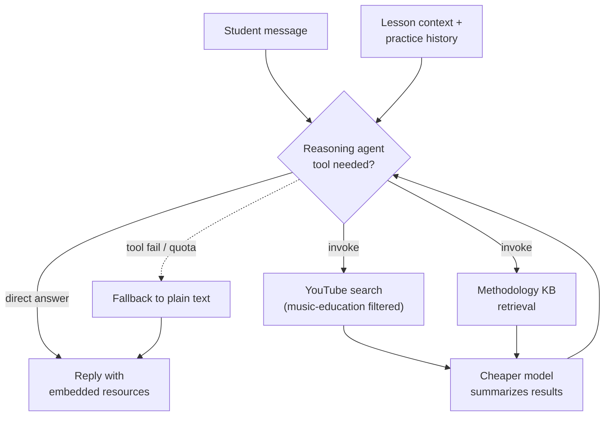

# Jaksam (작샘)

A cross-platform music-lesson app that helps students take more away from their lessons and practice independently. Built as a side project with my wife — a professional pianist and classical-piano teacher. Her students are all aspiring classical musicians on a professional path: from elementary-age performers in specialized programs through college and masters performers. **"Jaksam" (작샘)** is short for **작은선생님** ("small teacher") — a familiar term in the Korean classical-music community. It names both the product and the in-app AI coach.

## Problem

The hardest moment for an aspiring classical musician isn't the lesson — it's the week between lessons. Students leave the studio with notes and good intentions, then sit at the instrument the next day without a clear plan: what to practice, how to practice it, what "good" sounds like. My wife sees this every week. Even motivated students plateau when their practice loops drift from what the teacher actually said.

The product is our attempt to close that loop: **capture the lesson, extract a structured plan, and give the student a coach in their pocket that knows the lesson, the methodology, and the student's history.** The product is early — we're iterating with my wife's actual students as the test audience.

## What I built

A React Native (Expo) mobile app with role-based workflows for students, teachers, and parents, plus a Node.js orchestrator that turns raw lesson audio / video into structured practice guidance.

### Lesson recording → structured artifacts

- **Foreground chunked recording** (audio default, video optional) with resilient upload for weak networks — chunks queue locally and retry on reconnection. Time-away handling so leaving the screen pauses recording cleanly.
- **Orchestration pipeline**: chunks → Supabase Storage → Whisper transcription → LLM-generated summary with timestamped key points → practice plan. Each stage is a discrete LangChain step so the artifact at each level is something a student or teacher can act on directly.
- **Idempotent jobs** with retry and stale-job recovery in the orchestrator, so a flaky recording session doesn't lose work.

### Practice loop with feedback

- Students record practice sessions; the orchestrator generates ≤5 tailored feedback questions per session, low-friction by design so students actually answer.
- Practice hours dashboard for students. Progress visibility for teachers and parents.

### Jaksam — bounded agentic AI coach

The in-app coach is where the harder design work lives. Students chat with Jaksam between lessons to get specific guidance ("how do I practice the left hand of Bach Invention No. 1?"). Jaksam v2 made it agentic:

- **Reasoning + tools loop** capped at a small number of iterations. The coach decides when to invoke a tool vs. answer directly from context.
- **Two tools**: YouTube search filtered to music-education content for tutorial / technique videos, and a retrieval layer over an indexed practice-methodology knowledge base (markdown documents on music pedagogy techniques).
- **Cost-tiered model selection** — a reasoning-grade model for tool selection, a smaller / cheaper model for summarization subtasks. Per-message cost is bounded so the conversation stays cheap by default.
- **Graceful degradation** — if a tool fails (API quota, timeout, empty results), the coach falls back to a normal text response without breaking the conversation.
- Instrumented in Sentry (latency / cost spans) and PostHog (engagement events: `jaksam_message_sent`, `lesson_recording_completed`, `practice_session_completed`, etc.) so quality and cost can be iterated together.

### Multi-role design

- **Student** is the primary user — records, generates invite codes for linking.
- **Teacher** reviews student data and modifies practice plans.
- **Parent** monitors progress, read-only.
- All three roles share a single multi-tenant Supabase schema, with **row-level security policies** enforcing access at the database level rather than in app code.

### Korean-first internationalization

i18next with Korean as primary locale. The app UI, the AI coach's prompts, the pedagogy knowledge base, and the scheduled-message templates are all Korean-first. The audience is Korean classical-music students; the architecture supports adding English without rebuilding.

## Outcomes

- **Live on App Store and Google Play.** Early stage, growing user base, iterating with real students of my wife's.
- The core loop — record → structured artifacts → feedback → coach — is working end-to-end. The open problem is making the coach's recommendations specific enough to high-level classical repertoire that they meaningfully change practice quality. That's the design space the methodology knowledge base and the YouTube tool exist to fill.
- This is a product where success isn't measured in MAU. The right metric is whether a student moves a piece forward in a week — which is what we're now instrumenting toward.

## Notes

- Source at `~/personal/music-app/`. Spec docs at `docs/specs/{version}/` are the best read for design intent (e.g., `1_2_0/jaksam-agentic-coach.md` for the agentic coach v2 design).
- My wife is the domain anchor — every product decision has to survive a session with her own students. That tight feedback loop is unusual for a side project and is the real reason it's been worth building.
- Stage framing on resumes / website should stay accurate: "in production, early stage, iterating" rather than overstating traction.
