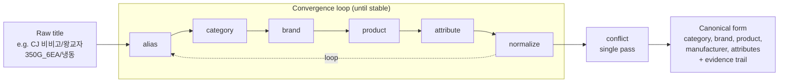
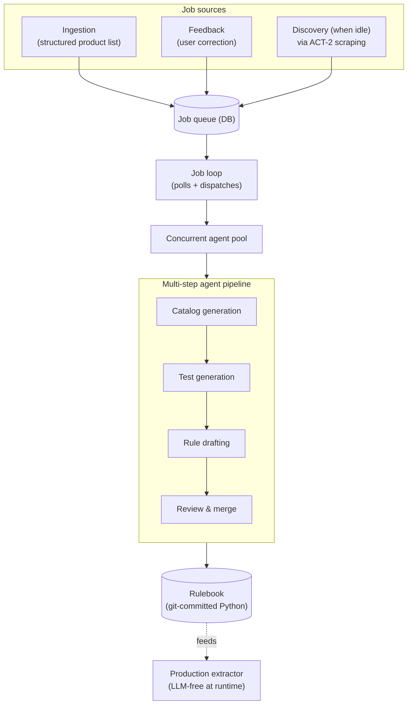

# Rule-based Extractor

A deterministic, LLM-free extraction service for Korean e-commerce product listings. Given a raw listing title (e.g., `CJ 비비고/왕교자350G_6EA/냉동`), the system returns a canonical structured form — **category, brand, product, manufacturer, attributes**. The canonical form is consumed by `agentos-matching.md` as the deterministic matching layer of that pipeline — SKUs that canonicalize to the same structured output match without any LLM call, materially improving the matching pipeline's accuracy / latency / cost.

## Problem

Korean e-commerce listing titles are noisy: encoding variants, vendor-specific suffixes, normalization gaps, category-specific conventions across Coupang, Naver, Ohouse, and others. Routing every match through an LLM is expensive and slow when most decisions are deterministic. Hand-authoring 6,000+ regex rules across hundreds of brands and categories is also untenable — the long tail keeps growing as new products appear.

The interesting space is the middle: a deterministic, auditable rulebook that runs at request time **without any LLM**, with a **self-improving build pipeline** that uses LLM agents *during build* to grow and maintain the rulebook from feedback and discovery.

## What I built

Two coupled systems that ship as one product:

### 1. The extractor — production runtime, LLM-free at inference

A FastAPI extraction service. Each request runs a deterministic 3-pass convergence pipeline:

- **6,400+ regex rules** across ~120 category files (e.g., `dumpling`, `instant_rice`, `sofa`), ~370 brand files (e.g., `비비고`, `MUJI`, `IKEA`), per-brand product rules, per-category attribute rules, plus normalization and conflict layers.
- **Constraint-gated rules** — attribute logic only fires when the relevant category/brand context exists, so rule sets compose cleanly instead of bleeding into each other.
- **Bundle segmentation** — `+`-joined listings are split, extracted independently per segment, and recomposed.
- **Evidence trail** — every response carries the rule IDs and matched spans that produced each field, so matches are auditable end-to-end.
- **Powers the deterministic matching layer of `agentos-matching.md`** — the canonical structured form is what the matching pipeline uses to decide deterministic matches and non-matches without an LLM call, contributing to the production funnel's high true-negative accuracy and to its cost / latency wins over the prior full-LLM baseline.
- **~11,000 tests** run the full pipeline against the production rulebook (no mocking).
- Deployed on AWS ECS Fargate with a React/Vite admin client for rule browsing and hot-reload.

### 2. The agent harness — self-improving build pipeline

Hand-curating 6,400 rules doesn't scale. I built a domain-specific agent harness around the extractor that turns rule maintenance into a continuous, autonomous process. **No LLM runs at inference time; LLM agents do the build-time work.**

- **DB-backed job queue** with three job types:
  - **Ingestion** (highest priority) — a structured product list comes in; the harness produces all the catalog and rule files for it.
  - **Feedback** — a user-submitted correction (e.g., "this listing should match Product X") becomes new tests + rules + regression fixes, committed to the rulebook.
  - **Discovery** — when the queue is idle, the harness analyzes coverage gaps and uses `act-2.md` (the browser automation platform) to scrape brand websites for new products to ingest. The cross-project connection is intentional: ACT-2 provides the scraping execution, the rulebook harness consumes the discovered products, and the rule-based extractor consumes the resulting rules — the loops feed each other.
- **Job loop** polls the queue continuously, dispatches each job to a pool of concurrent agents, and ensures the DB is left in a clean state regardless of outcome.
- **Multi-step ingestion pipeline** — each ingestion job runs through a sequence of focused agent steps that turn the structured product list into catalog files, generate real-world test cases, draft and review the rules, and produce attribute coverage. A stage report flows between steps so each step has structured context from the prior ones.
- **Test-first** — every new rule lands with paired regression tests against the production corpus before merge, so the rulebook only ever gets better.
- **Audit-friendly artifacts** — the harness produces Python rule files committed to git, not opaque LLM-generated weights. Every change is reviewable and revertible.

The result is a system that **only gets better over time**. Ingestion expands coverage. Feedback corrects misclassifications. Discovery finds the long tail before customers complain. The extractor stays deterministic and fast at request time; all the AI lives in the build loop.

## Outcomes

- **~98% true-negative accuracy** as a matching algorithm in production.
- **No LLM at inference** — orders-of-magnitude faster and cheaper than the prior full-LLM pipeline; this is the deterministic layer that lets `agentos-matching.md` route only ~33% of decisions to LLM.
- **6,400+ rules and ~11,000 tests** as of last sync, growing continuously via the harness.
- **Self-improving**: every feedback job is a free training signal; every discovery job expands coverage. The rulebook is institutional memory for what we've learned about Korean e-commerce title conventions.
- **Auditable by humans and machines** — Python rule files in git, evidence trails on every response.

## Notes

- Source code at `~/agent-pipeline/rule-based-extractor/`. README, API docs, and skill specs are in-repo.
- Harness skills live under `.claude/skills/`; the job loop is `scripts/job_loop.sh`.
- Counts (6,400 rules, 11,000 tests, 120 categories, 370 brands) drift upward as the harness adds more.
